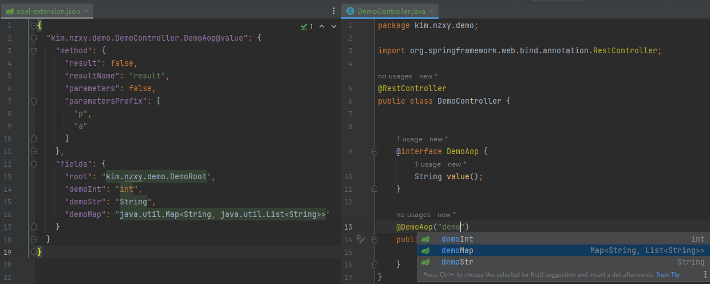
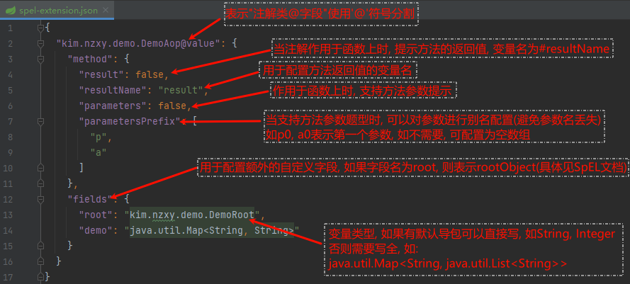

# SpEL Assistant

## 简介

用于支持IDEA中自定义注解支持SpEL表达式自定义上下文, 方法参数/返回值, 以及自定义root节点

注意: 此插件仅仅是SpEL在IDEA中的代码提示, 并非写上注解就支持解析了, 得自己写解析流程

### 使用

1. [安装此插件](https://plugins.jetbrains.com/plugin/23542-spel-assistant)

2. 在项目中resource文件夹下新建`spel-extension.json`配置文件

   > 如果您引入的第三方库也包含此文件, 则会一并纳入到配置中, 其中针对同一个注解上的字段的配置, 本地配置将会覆盖库中的配置

3. 正常在项目中调用即可, 如果没能及时生效, 请尝试手动保存一下`spel-extension.json`文件, 以便快速生效

### 配置详解

